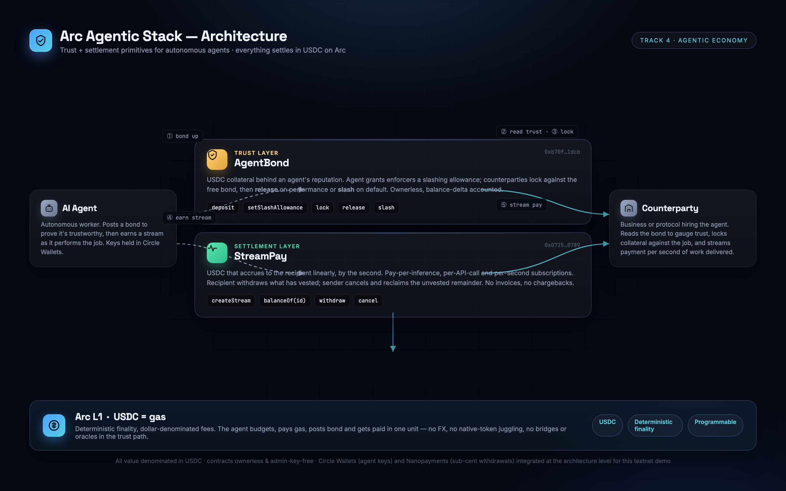

# Arc Agentic Stack

**Trust + settlement primitives for autonomous agents — settled in USDC on Arc.**

Submitted to the Circle *Stablecoin Commerce Stack Challenge* — **Track 4: Best Agentic Economy Experience on Arc.**

Every "agentic" demo quietly assumes two things that don't actually exist on-chain yet: that you can **trust an agent before it touches your money**, and that you can **pay it continuously as it works** instead of after the fact. The Arc Agentic Stack ships both as small, composable, ownerless contracts.

| | Layer | Contract | What it answers |
|---|---|---|---|
| 🛡️ | **Trust** | [`AgentBond`](#agentbond--trust-layer) | *"Can I trust this agent before it acts?"* |
| 💧 | **Settlement** | [`StreamPay`](#streampay--settlement-layer) | *"Can I pay it per second of work, not per invoice?"* |

Each works standalone. Together they form a complete trust-and-pay rail for autonomous agents.

---

## Live demo

- **Hub:** https://mnorbert87.github.io/arc-agentic-stack/
- **AgentBond:** https://mnorbert87.github.io/arc-agentic-stack/agent-bond/
- **StreamPay:** https://mnorbert87.github.io/arc-agentic-stack/stream-pay/

No backend. The frontends read live state straight from the public Arc RPC and write through MetaMask. Wallet not required to browse.

> ⚠️ **Testnet demo only.** Deployed on Arc Testnet (chain `5042002`). Not audited for production; do not send mainnet funds.

---

## Deployments (Arc Testnet · chain 5042002)

| Contract | Address |
|---|---|
| AgentBond | [`0xb70f607de14afd682cc834352460a664e25e1dcb`](https://testnet.arcscan.app/address/0xb70f607de14afd682cc834352460a664e25e1dcb) |
| StreamPay | [`0x072599dd2121b9b5b9b59cebe0c9e32c5ea00789`](https://testnet.arcscan.app/address/0x072599dd2121b9b5b9b59cebe0c9e32c5ea00789) |

- **RPC:** `https://rpc.testnet.arc.network`
- **Explorer:** `https://testnet.arcscan.app`
- **Gas / settlement token:** USDC (native gas on Arc; 6-decimal ERC-20 for value)

---

## Architecture



An autonomous agent lifecycle, settled end-to-end in USDC:

1. **Bond up** — the agent deposits USDC into `AgentBond`. Its *free* bond becomes a public, slashable credit score. *(AgentBond)*
2. **Get hired** — a counterparty reads the bond and decides the agent is trustworthy enough for the job. *(off-chain)*
3. **Lock collateral** — the counterparty locks a slice of the agent's bond behind the job as an *obligation*. *(AgentBond)*
4. **Stream pay** — it opens a `StreamPay` stream; the agent earns USDC by the second as it works. *(StreamPay)*
5. **Settle** — performed → bond released & stream withdrawn; defaulted → bond slashed to the creditor, stream cancelled. *(both)*

Both contracts are **ownerless** — no admin, no upgrade key — and track balances by **real balance delta**, so they stay solvent against any token and can't be rugged by privileged roles.

### AgentBond — trust layer

A reputation deposit that behaves like an ERC-20 allowance system for *slashing*:

- `deposit(amount)` / `withdraw(amount)` — manage your bond. *Free* bond = total − locked.
- `setSlashAllowance(enforcer, amount)` — authorize a specific protocol to lock & slash up to `amount`. Set `0` to revoke.
- `lock(agent, creditor, amount) → id` — an enforcer locks a slice of an agent's bond behind an obligation (spends the allowance).
- `release(id)` — agent performed; capacity revolves back to free bond.
- `slash(id)` — agent defaulted; the bond pays the creditor, that capacity is burned.

### StreamPay — settlement layer

Linear, per-second USDC accrual — the right shape for continuous agent work:

- `createStream(recipient, deposit, start, stop, memo) → id` — escrow USDC that vests linearly between `start` and `stop`.
- `balanceOf(id)` — how much has vested to the recipient right now.
- `withdraw(id, amount)` — recipient pulls vested funds at any moment.
- `cancel(id)` — split the stream at "now": recipient keeps the vested part, sender reclaims the rest.

Concrete fits from the Track 4 brief: **pay-per-inference agents**, **per-API-call billing**, and **per-second / streaming subscriptions**.

---

## How Circle products are used on Arc

| Product | Role | Status |
|---|---|---|
| **USDC** | The settlement rail for *both* bonds and streams. All value in the stack is USDC. | ✅ Live on testnet |
| **Arc** | Deterministic finality + USDC-denominated fees let an agent budget, pay gas, post bond and settle in one unit. | ✅ Live on testnet |
| **Circle Wallets** | Intended key-management layer for agent-initiated transactions. | 🧩 Architecture-level |
| **Nanopayments** | Natural fit for sub-cent, high-frequency stream withdrawals at scale. | 🧩 Architecture-level |

🧩 = integrated at the architecture level for this testnet demo; the live contracts transact USDC on Arc directly.

---

## Run it locally

### Contracts (Foundry)

```bash
# from each contract dir: contracts/agent-bond, contracts/stream-pay
forge install foundry-rs/forge-std   # test/script dependency (gitignored)
forge build
forge test                            # full unit + adversarial suites
```

Deploy to Arc Testnet:

```bash
export PRIVATE_KEY=0x...        # a testnet burner with Arc testnet USDC
export RPC_URL=https://rpc.testnet.arc.network
forge script script/Deploy.s.sol --rpc-url $RPC_URL --private-key $PRIVATE_KEY --broadcast
```

### Frontends (static, zero-build)

```bash
cd web && python3 -m http.server 8080
# open http://localhost:8080
```

Each frontend is a single `index.html` using `ethers` from a CDN — no install, no bundler, host anywhere static.

---

## Circle Product Feedback

### Why we chose these products

We deliberately built on **USDC + Arc only** for the trust path, and reserved **Circle Wallets** and **Nanopayments** for the layers where they're the obvious fit. Arc's *USDC-as-gas* model is what makes an agent economy actually clean: an autonomous agent can hold one balance and use it to pay fees, post collateral, and receive streamed income without ever touching a separate native gas token or an FX hop. That single-unit accounting is the difference between a demo and something an agent could really operate inside.

### What worked well

- **Deterministic, dollar-denominated fees.** Budgeting agent actions in USDC instead of a volatile gas token removed an entire class of "did the tx have enough gas" failure handling from our agent logic.
- **Standard EVM tooling.** Foundry, `ethers`, and MetaMask worked against the Arc Testnet RPC with zero special-casing beyond the chain id (`5042002`) and explorer URL. We shipped two contracts + full adversarial test suites + three frontends with no Arc-specific SDK lock-in.
- **6-decimal ERC-20 USDC** behaved exactly like USDC elsewhere, so our balance-delta accounting (which keeps the contracts solvent and ownerless) needed no Arc-specific adjustments.

### What could be improved

- **The 18-decimal native gas / 6-decimal ERC-20 USDC split is a real footgun.** It's easy to reason about "USDC" as one thing and then off-by-12-decimals yourself when a value crosses between gas and token contexts. A first-class helper or a loud doc callout right at the top of the quickstart would save every team this bug.
- **Testnet faucet throughput** was the main bottleneck for seeding multi-actor demos (agent + enforcer + creditor + stream sender/recipient all need balances). A higher per-request amount or a batch faucet for hackathon accounts would speed up realistic multi-party testing.
- **Explorer indexing lag** on freshly deployed contracts occasionally made verification feel slow; a "pending verification" state would reassure builders that the tx landed.

### Recommendations to make the developer experience more seamless

1. Ship a tiny **`@circle/arc` quickstart** that bakes in chain id, RPC, explorer, USDC address, and the decimal helper — the four things every team re-derives by hand.
2. Provide a **canonical testnet USDC** address in the docs header (we hardcoded ours from on-chain reads; a documented constant removes guesswork).
3. Publish a reference pattern for **agent-held keys via Circle Wallets** signing Arc transactions — that's the missing primitive between "smart contract" and "autonomous agent," and an official pattern would unblock the whole Track 4 category.

---

## Repository layout

```
arc-agentic-stack/
├── index.html              # hub (this stack's landing page)
├── architecture.png        # the diagram above
├── agent-bond/             # AgentBond frontend (index.html)
├── stream-pay/             # StreamPay frontend (index.html)
└── contracts/              # Foundry projects (src, test, script)
```

MIT licensed. Built for the Circle Stablecoin Commerce Stack Challenge.
